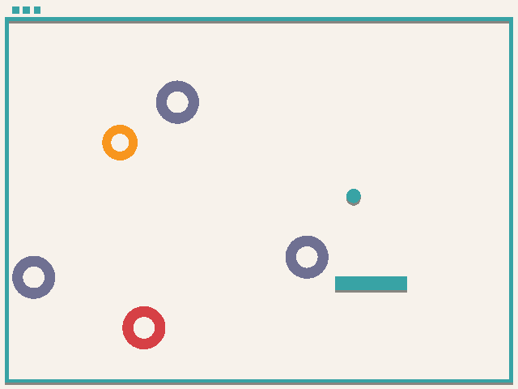

# kaleidoscope

Author:

Design: 

- Colorful targets will be generated at random places
- The paddle can be moved anywhere to hit the ball
- Gravity is simulated

Screen Shot:

How To Play:

- Score points by hitting the ball into the colorful holes with the paddle controlled by the mouse

This game was built with [NEST](NEST.md).
